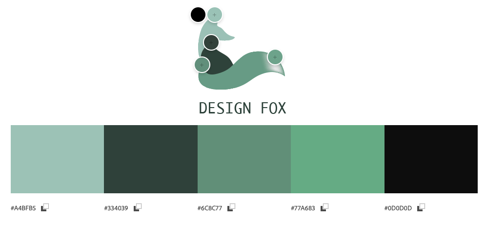
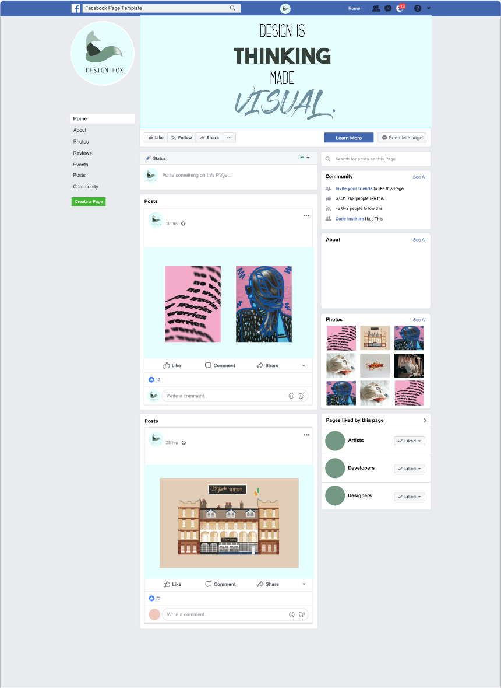

<h1 align="center"></h1>

# Design Fox
### A graphic Design E-Commerce Business

### [Link to the live site](https://design-fox-0911e03a4419.herokuapp.com/)


### Overview

For the final 5th project as part of the Full Stack Software Development course at Code Institute, I decided to bring in the idea of my own personal design entity brand for a Graphic Design E-Commerce store. As part of the project, I have implemented CRUD (Create, Read Update & Delete) features, as well as 3 custom Django Models that meet the learning outcome expectations of the final course module.


<h1 align="center"></h1>


## Site User Goals
Creative Business Owners:
Clients who are business owners looking for high-quality branding, web design, or packaging design to elevate their brand and stand out in a competitive market.

Busy Professionals:
Clients who lead busy lives and want a simple, straightforward process for requesting design services without the need for extensive back-and-forth emails or calls.

Entrepreneurs Starting a New Venture:
Clients who are launching a new business and need a cohesive brand identity, from logo creation to packaging, to establish their presence effectively.

Established Businesses Seeking a Refresh:
Clients looking to rebrand or improve their existing designs to keep up with trends and maintain relevance in their industry.

Personal Projects:
Clients interested in smaller design projects (e.g., invitations, custom artwork) who value the ability to inquire easily without committing to a full consultation.

Informed Decision-Makers:
Clients who want clear information about services, pricing, and past work to make an informed decision before reaching out.

Collaboration-Minded Individuals:
Clients who want to work closely with a designer who understands their vision and provides a personalized service experience.

## Site Owner Goals
User-Friendly Website:
To have a visually appealing, intuitive website that reflects the brand's ethos and streamlines the process for potential clients to inquire about design services.

Efficient Quote Management:
To have an integrated system that allows for easy management of quote requests, ensuring timely responses and clear organization of inquiries.

Portfolio Showcase:
To showcase past work in an elegant, professional way that demonstrates the range and quality of design services offered.

Update Flexibility:
To easily update services, pricing, and project availability as the business evolves or new offerings become available.

Scalability:
To maintain a website structure that can grow with the business, accommodating future features like client portals, project tracking, or new service categories.

Brand Representation:
To ensure that the website not only serves functional purposes but also communicates the brand's ethos, professionalism, and creativity to all visitors.

Secure Client Data:
To handle sensitive client information responsibly and professionally, adhering to privacy standards to build trust with clients.

Reduced Administrative Work:
To reduce the time spent on administrative tasks, such as responding to basic inquiries, by providing comprehensive service details and FAQs on the website.

Feedback and Testimonials:
To gather and showcase testimonials from happy clients to build credibility and trust with new visitors.

Ongoing Engagement:
To encourage repeat business by building lasting relationships with clients through follow-up emails, newsletters, or special offers.


### Brand Identity & Colour Palette

I chose the colour palette for my entire site based off the logo that I designed for the business. Since my last name is Fox, I chose a fox icon design after doing some rough sketches before bringing it into Adobe Illustrator to finish off the final vector image. I went with varying shades of emerald green, which is my favourite colour. I feel this is a nice true reflection of the brand and theme for the E-commerce store identity.

<h1 align="center"></h1>


### Wireframes


<h1 align="center"></h1>
<h1 align="center"></h1>

# UX

## Data Structure

<h1 align="center"></h1>

After deciding on the features for my project, I created a database structure schema to get an idea of how my data base and relationships between each type would work.

# Agile Development

Using GitHub Projects, I took on this project using Agile development methods to take each task one at a time and handle it in an organised manner. I found this method really wonderful for keeping track of where I was at in between working on the project.

# User Stories

Github projects was used to help me keep track of project features and to help me focus on each sprint. I created a kaban board for my user stories, and added the MoSCoW (Must have, Should have, Could have, Won't have) prioritization to my user stories.

- #### Account Registration
  As a site user, I can register an account so that I can easily request design quotes and keep track of my inquiries.

- #### Log In
  As a user, I can log in so that I can access my profile and view the status of my design project inquiries.

- #### Request a Quote
  As a registered user, I want to request a design quote directly on the website so that the process is straightforward and avoids the hassle of sending multiple emails.

- #### Contact Information
  As a user, I want to view information about Laura's location, contact details, and availability so that I know how and when to reach out.

- #### Services Overview
  As a user, I want to clearly see a list of services (e.g., branding, web design, packaging design) along with descriptions of how each can improve my business so that I can decide which service suits my needs best.

- #### Admin Functionality
  As an admin, I need CRUD access to manage service offerings, update client inquiries, and edit website content so that the platform remains current and user-friendly.

- #### Portfolio/Gallery
  As a user, I want to browse Laura's portfolio of past projects so that I can trust the quality and style of the work.

- #### About
  As a user, I can read about Laura's background, ethos, and approach to design so that I feel confident working with her.

- #### Admin Adjustments
  As a site admin, I can update service descriptions, adjust pricing, and manage client requests to keep the platform flexible and professional.

- #### Update Quote Requests
  As a registered user, I can update or cancel my quote requests if my project requirements change, making the experience more flexible.

- #### General Inquiry Submission
  As a user, I can submit a general inquiry without specifying the service I need so that I can ask questions or seek guidance.

- #### Confirmation Email
  As a user, I can receive an email confirmation after submitting a quote request or inquiry so that I have a record of my submission.

# Features

All pages, except for the customer profile portal and wishlist can be used/viewed without registering for an account.
Only the site owner can view the product management section when logged in as the superuser.

## Base HTML:

The header/nav bar and footer were created in a base file and loaded onto each page at the start of every file.

<h1 align="center"></h1>
<h1 align="center"></h1>

### Index

The home page (index) features a minimal header with a large hero image for visual impact. Under the hero image is a small about section and groomer profiles to give the client an idea of the salon, and also to help match them with the right groomer for their needs.

<h1 align="center"></h1>
<h1 align="center"></h1>
<h1 align="center"></h1>


##  About


<h1 align="center"></h1>
<h1 align="center"></h1>

## Shop 

## Services

## Testimonials


<h1 align="center"></h1>

## Design Quote

<h1 align="center"></h1>

## Contact


## Customer profile

## Cart

## Wishlist

## Admin product management

## Newsletter Sign Up

## Privacy Policy


<h1 align="center"></h1>


## Custom Django Models

### Design Quote

### Testimonials

### Wishlist


## Authentication

- User can sign up and create their own profile for purchasing items and obtaining a quote
- User can book their own  (CRUD Functionality)
- Safety ensured via [Django-AllAuth](https://github.com/pennersr/django-allauth) & csrf tokens

## Features Left To Implement


# Web Marketing Strategies

Questions to consider

- Who are your users?
- Which online platforms would you find lots of your users?
- Would your users use social media? If yes, which platforms do you think you would find them on?
- What do your users need? Could you meet that need with useful content? If yes, how could you best deliver that content to them?
- Would your business run sales or offer discounts? How do you think your users would most like to hear about these offers?
- What are the goals of your business? Which marketing strategies would offer the best ways to meet those goals?
- Would your business have a budget to spend on advertising? Or would it need to work with free or low cost options to market itself?

## SEO 

## Social Media Marketing

Social media accounts

<h1 align="center"></h1>

## Email Marketing

Newsletter


# Technology

- Html - for page structure
- CSS - Custom styling
- Python - Backend development
- Javascript - Pop up modals
- Django - Project Framework
- Heroku PostgreSQL - Database
- Font Awesome - Social icons
- Bootstrap 5 - Front end styling framework
- Google Fonts- Font styling
- GitHub - Code and Kaban
- Heroku - Hosting & Deployment


# Testing

- HTML Validation

<h1 align="center"></h1>

- CSS Validation

<h1 align="center"></h1>

- Pep8 CI Linter passed (Example file):

<h1 align="center"></h1>


## Manual testing

Chrome DevTools was used during the development process to check and modify HTML and CSS styles used in the project.

### Account Registration

| Test |Result  |
|--|--|
| User can create a profile | Pass |
| User can log in | Pass |
| User can log out | Pass |
| Messages displaying | Pass |

### User Navigation Tests

| Test | Result  |
|--|--|
| User can navigate to  | Pass |
| User can access each page | Pass|
| SuperUser can access admin page|Pass|

#### Account Authorisation Tests

| Test | Result  |
|--|--|
| Only Superuser can access admin page |Pass|
| Non authorised user can't access profile or booking page| Pass|

#### Booking and Profile

| Test |Result  |
|--|--|
|User can make a booking | Pass |
|User can view upcoming bookings | Pass |
|User can delete any booking | Pass |
|User can update booking | Pass |
|User can make multiple bookings | Pass |
|User can see the confirmation information | Pass |

### Responsiveness

- The website is entirely responsive thanks to Bootstrap and media queries
- Hamburger navbar will display on smaller devices, and layout changes will update.

### Browser Testing

Browser | Outcome | Pass/Fail |
--- | --- | --- |
Google Chrome | No issues found (appearance/responsiveness)| Pass |
Safari |  No issues found (appearance/responsiveness) | Pass |
Mozilla Firefox |  No issues found (appearance/responsiveness)| Pass |
Microsoft Edge |  No issues found (appearance/responsiveness) | Pass |

### Lighthouse Testing 

<h1 align="center"></h1>
<h1 align="center"></h1>


### Known Issues & Bugs


<h1 align="center"></h1>


# Deployment

> Heroku app

- Sign up or Log in to Heroku
- On the Dashboard page select 'New', then 'Create New App'
- Name the project (In this case, The Luxe Spaw)
- Select EU (or whatever region you are in)
- Select "Create App"
- On the "Deploy" tab choose GitHub
- Connect your GitHub account or repository

> enviroment variables

- Go to Django app editor and create env.py in the top level
- In env.py import os
- In env.py, set up necessary enviroment variables:
  - add a secret key using: os.environ['SECRET_KEY'] = 'your secret key'
  - for the database variable the line should include os.environ['DATABASE_URL']= 'Paste the database link in here'
  - in settings.py replace value of SECRET_KEY variable with os.environ.get('SECRET_KEY')
  - in settings.py change the value of DATABASES variable to 'default': dj_database_url.parse(os.environ.get("DATABASE_URL"))
- In Django app's settings.py on top of the file add:
```
from pathlib import Path
import os
import dj_database_url
if os.path.isfile('env.py'):
    import env
```
- Go to "Settings" tab in Heroku
- Open "Config Vars" section and add DATABASE_URL as Key and the database link from app's env.py as Value
- Add SECRET_KEY for the Key value and the secret key value from env.py as the Value
- In the terminal migrate the models over to the new database connection
- In settings.py add the STATIC files settings as follows:
```
STATIC_URL = '/static/'
STATICFILES_DIRS = [os.path.join(BASE_DIR, 'static')]
STATIC_ROOT = os.path.join(BASE_DIR, "staticfiles")
```
- Change the templates directory in settings.py to: TEMPLARES_DIR = os.path.join(BASE_DIR, 'templates')
- In TEMPLATES variable change the 'DIRS' key to look like this: 'DIRS': [TEMPLARES_DIR],
- Add Heroku to the ALLOWED_HOSTS list (the format will be your-app-name.herokuapp.com, you can copy it from the Domains section in Settings tab in your Heroku app)
- If you haven't done that up to this point, then create in your Django app's code editor new top level folders: static and templates
- Create a new file on the top level directory - Procfile
- Within the Procfile, add:
```
web: guincorn PROJECT_NAME.wsgi
``` 
- In the terminal, add the changed files, commit and push to GitHub

> Heroku deployment

- In Heroku, navigate to the Deployment tab and deploy the branch manually 
- Heroku will display a build log- watch the build logs for any errors
- Once the build process is completed, Heroku displays 'Your App Was Successfully Deployed'
- You can then navigate to the live app link via the link at the bottom or top of the page

#### Forking the repository

- Log in to GitHub/create an account
- Enter this [repository link]()
- Select "Fork" from the top of the repository
- A copy of the repository will be created in your own repository


# Credits

# Resources

- Initial project set up & AllAuth section followed along from 'Boutique Ado' course lesson
- [W3SCHOOLS](https://w3schools.com/) - General source of info & troubleshooting resource
- [STACK OVERFLOW](https://stackoverflow.com/) - General source of info & troubleshooting resource


### Media

- Royalty free images from [Unsplash](https://unsplash.com/) & [Pexels](https://pexels.com/)
- Site logo, hero image and favicon designed and made by me
- Text sections derived from [OpenAI](https://openai.com/dall-e-2).

### Acknowledgements

I wish to thank Code Institute staff, with special mention to the Student Care Team who have been extremely helpful during my time on this course. It's been a rollercoaster of a year, a year which I decided to challenge myself to jump completely out of my comfort zone to take on this course. I also with to thank my mentor Excellence for his guidance during this final project, and the previous ones along the way. 
