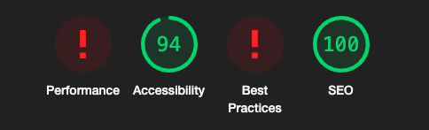

<h1 align="center"></h1>

# Design Fox
### Graphic Design E-Commerce Business

### [Link to the live site](https://design-fox-0911e03a4419.herokuapp.com/)


### Overview

For fifth and final project of the Full Stack Software Development course at Code Institute, I decided to bring in the idea of my own personal design entity for a Graphic Design E-Commerce business. As part of the project, I have implemented CRUD (Create, Read Update & Delete) features, as well as 3 custom Django Models that meet the learning outcome expectations of the final course module.

I liked the idea of creating a design / store hybrid, where potential clients can come find out more about design services, and others can browse and purchase prints and accesories with various design concepts. It's a business idea I would love to have myself in the future at some stage, so I thought I would try out the concept to see how it would look!


<h1></h1>


## Site User Goals
Creative Business Owners:
Business owners looking for high-quality branding, web design, or packaging design to elevate their brand and stand out in a competitive market.

Busy Professionals:
Clients who lead busy lives and want a simple, straightforward process for requesting design services without the need for extensive back-and-forth emails or calls.

Entrepreneurs:
Clients who are launching a new business and need a cohesive brand identity, from logo creation to packaging, to establish their presence effectively.

Businesses Seeking a Refresh:
Clients looking to rebrand or improve their existing designs to keep up with trends and maintain relevance in their industry.

Personal Projects:
Clients interested in smaller design projects (e.g., invitations, custom artwork) who value quick and easy contact methods without committing to a full consultation.

Informed Decision-Makers:
Clients who want clear information about services, pricing, and past work to make an informed decision before reaching out.


## Site Owner Goals
User-Friendly Website:
To have a visually appealing, intuitive website that reflects the brand's ethos and streamlines the process for potential clients to inquire about design services.

Efficient Quote Management:
To have an integrated system that allows for easy management of quote requests, ensuring timely responses and clear organization of inquiries.

Portfolio Showcase:
To showcase past work in an elegant, professional way that demonstrates the range and quality of design services offered.

Update Flexibility:
To easily update services, pricing, and project availability as the business evolves or new offerings become available.

Scalability:
To maintain a website structure that can grow with the business, accommodating future features like client portals, project tracking, or new service categories.

Brand Representation:
To ensure that the website not only serves functional purposes but also communicates the brand's ethos, professionalism, and creativity to all visitors.

Secure Client Data:
To handle sensitive client information responsibly and professionally, adhering to privacy standards to build trust with clients.

Reduced Administrative Work:
To reduce the time spent on administrative tasks, such as responding to basic inquiries, by providing comprehensive service details on the website.

Feedback and Testimonials:
To gather and showcase testimonials from happy clients to build credibility and trust with new visitors.

Ongoing Engagement:
To encourage repeat business by building lasting relationships with clients through follow-up emails, newsletters, or special offers.


### Brand Identity & Colour Palette

I chose the colour palette for my entire site based off the logo that I designed for the business. Since my last name is Fox, I chose a fox icon design after doing some rough sketches before bringing it into Adobe Illustrator to finish off the final vector image. I went with varying shades of emerald green, which is my favourite colour. I feel this is a nice true reflection of the brand and theme for the E-commerce store identity.

<h1></h1>


### Wireframes

I usually keep wireframes fairly simple and had a standard idea of how I wanted my site to look. I love the minimalist look and feel of sites that have paired back UX/UI.

<h1></h1>


## Data Structure

<h1></h1>


After deciding on the features for my project, I created a database structure schema to get an idea of how my data base and relationships between each type would work. At the end of the project, I did update the schema as ideas changed along the way and I decided to add a wishlist.

# Agile Development

Using GitHub Projects, I took on this project using Agile development methods to take each task one at a time and handle it in an organised manner. I found this method really wonderful for keeping track of where I was at in between working on the project.

# User Stories

Github projects was used to help me keep track of project features and to help me focus on each sprint. I created a kaban board for my user stories, and added the MoSCoW (Must have, Should have, Could have, Won't have) prioritization to my user stories and assigned them into Milestones.

- #### Account Registration
  As a site user, I can register an account so that I can easily request design quotes and keep track of my inquiries.

- #### Log In
  As a user, I can log in so that I can access my profile, update my address and see previous order history

- #### Request a Quote
  As a registered user, I want to request a design quote directly on the website so that the process is straightforward and avoids the hassle of sending multiple emails.

- #### Contact Information
  As a user, I want to view information about the business location, contact details, and availability so that I know how and when to reach out.

- #### Services Overview
  As a user, I want to clearly see a list of services (e.g., branding, web design, packaging design) along with descriptions of how each can improve my business so that I can decide which service suits my needs best.

- #### Admin Functionality
  As an admin, I need CRUD access to manage service offerings, update client inquiries, and edit website content so that the platform remains current and user-friendly.

- #### Portfolio/Gallery
  As a user, I want to browse the portfolio of past projects so that I can trust the quality and style of the work.

- #### About
  As a user, I can read about background, ethos, and approach to design so that I feel confident working together.

- #### Admin Adjustments
  As a site admin, I can update service descriptions, adjust pricing, and manage client requests to keep the platform flexible and professional.

- #### Update Quote Requests
  As a registered user, I can update or cancel my quote requests if my project requirements change, making the experience more flexible.

- #### Confirmation Email
  As a user, I can receive an email confirmation after submitting a quote request or inquiry so that I have a record of my submission.

# Features

All pages, except for the customer profile portal and wishlist can be used/viewed without registering for an account.
Only the site owner can view the product management section when logged in as the superuser.

## Base HTML:

The header/nav bar and footer were created in a base file and loaded onto each page at the start of every file.

Header:
<h1></h1>

Footer:
<h1></h1>

### Index

The home page (index) features a minimal header with a large hero image for visual impact. Under the hero image is the portfolio section, displaying some various visual works. Alongside this are click through contact buttons.

<h1></h1>
<h1></h1>
<h1></h1>
<h1></h1>


##  About

The about section on the main navigation header features a drop down bar option linking to an about section, and the other linking to a portfolio section. Here, I created a short blurb about myself and what services I offer, along with a button linking to a contact section.

<h1></h1>

## Shop 

The shop section was followed along to boutique ado walkthrough. I found this really helpful in preparation for creating my own custom models for other features on the site.

<h1></h1>

## Services

For services, I kept this page very simple with bootstrap styling and general information for the potential client to get an idea of services ahead of requesting a design quote.

<h1></h1>

## Testimonials

This part of the site is the first of three custom models for the e-commerce site. Currently anyone can submit a testimonial, but they will only appear in the 'What our clients are saying' section after approval in the admin panel by the superuser. 

<h1></h1>

## Design Quote

Here we have the second custom model, a contact form where the potential clients can reach out with their interest and potential ideas and information for design services. The idea is that the form would submit to the business' email address, and the conversation will continue via email or call. It is not currently set up to email, but I tested it on the console.

<h1></h1>

## Contact

The contact section is all the contact sources in the one place to reach out to the business. I added a google map feature which I personally really like as an additional touch to a website.

<h1></h1>

## Customer profile

Here the customer can update their address on file or see their order history if they made any purchases in the shop.

<h1></h1>


## Wishlist

The final custom model for the project, the wishlist, is my favourite addition to have added to the site. I had thought it's implementation would be way harder, but after watching several walkthroughs and searching on slack from fellow students, I was able to implement it and add a clickable heart favicon to bring the user to the page.

<h1></h1>

## Bag

The bag and checkout sections were mostly followed along to the boutique ado walk through, with some tweaks and adjustments. 

<h1></h1>

## Checkout & Stripe

The checkout part of the walk along course tutorials were definitely the most interesting to follow along to with the implementation of Stripe. I learned so much about Stripe and how powerful this is that it can be implemented into any project build. 

<h1></h1>

## Confirmation

The confirmation page displays directly after card payment info has been entered and submitted.

<h1></h1>

## Order History

A small panel overview of previous purchase history on the user profile.

<h1></h1>


## Newsletter Sign Up

Thanks to MailChimp, it was very easy to set up a business campaign and generate a newsletter box for site visitors to sign up to. I updated the CSS styling of the code provided by MailChimp to keep in with the UX/UI of the website.

<h1></h1>

## Privacy Policy

The privacy policy is available through a click through link in the footer.

<h1></h1>
<h1></h1>


### 404 Page

An error 404 page will render when a wrong weblink is entered. 

<h1></h1>

## Authentication

- User can sign up and create their own profile for purchasing items and obtaining a quote
- User can book their own  (CRUD Functionality)
- Safety ensured via [Django-AllAuth](https://github.com/pennersr/django-allauth) & csrf tokens

## Features Left To Implement
I'd like to add several features in the future including:

- A "recently viewed" section would be a nice addition to the UX/UI.
- Sign in with Gmail account
- Sign in only to submit a testimonial
- Add a CAPTCHA or similar for testimonial section

# Web Marketing Strategies

## SEO 

For the web marketing strategies course modules, we had a series of questions to consider for our E-Commerce store. 
After thinking about the following questions, I came up with a series of relevant keywords to implement in my project's meta and alt tags for SEO purposes.

Questions to consider

- Who are your users?
- Which online platforms would you find lots of your users?
- Would your users use social media? If yes, which platforms do you think you would find them on?
- What do your users need? Could you meet that need with useful content? If yes, how could you best deliver that content to them?
- Would your business run sales or offer discounts? How do you think your users would most like to hear about these offers?
- What are the goals of your business? Which marketing strategies would offer the best ways to meet those goals?
- Would your business have a budget to spend on advertising? Or would it need to work with free or low cost options to market itself?

Short-Tail Keywords:
1. Graphic Design
2. Branding Services
3. Graphic Design Ireland
5. Logo Design
6. Website Design
7. Professional Design
8. Print Design
9. Illustration Design
10. Creative Branding

Long-Tail Phrases:
1. Graphic Design Services in Ireland
2. Creative Branding Solutions
3. Elevate Your Brand with Stunning Design
4. Logo Design for Small Businesses
5. Professional Web Design Services
6. Captivating Visuals for Marketing Campaigns
7. Modern and Minimalist Graphic Design
8. Design Solutions for Startups
9. Brand Identity Development
10. Designs for Print and Digital


<h1></h1>

## Meta Data
<h1></h1>

## Sitemap

I've used XML-Sitemaps to generate a sitemap file. I downloaded the sitemap.xml and included in the repository.

## Robots

I've created the robots.txt file. 

## Social Media Marketing

I created a mockup of a business facebook page for the business. I think for a graphic design style business, Facebook and Instagram would be the best suited for marketing visually to the target audience.

<h1></h1>

## Email Marketing

Thanks to Mail Chimp, we can integrate a newsletter sign up box directly into the footer of the site. This allows us to market the business to those who want to sign up to learn more or receive offers.

<h1></h1>

# Technology

- Html - for page structure
- CSS - Custom styling
- Python - Backend development
- Javascript - Pop up modals
- Django - Project Framework
- Font Awesome - Social icons
- Bootstrap - Front end styling framework
- Google Fonts - Font styling
- GitHub - Code and Kaban
- Heroku - Hosting & Deployment


# Testing

- HTML Validation

HTML passes validation on all HTML pages.

<h1></h1>

- CSS Validation

Code passes CSS validation.

<p>
    <a href="https://jigsaw.w3.org/css-validator/check/referer">
        
    </a>
</p>

- Pep8 CI Linter

I had to update some longer passages on files, but now passes.
<h1></h1>

### Lighthouse Testing 

Lighthouse testing produced some strange returns for my project. When I first ran it, performance and best practice issues were appearing red, as seen below. In incognito the first time, best practices changed to a score of 78. When I retested today again on incognito (2 days after first testing), it appeared red again. Chat GPT and Stack Overflow tells me the issue is likely with Lighthouse rather than my project when I searched the error code. I ran out of time to look into this further before project submission, but I want to find out more ahead of any future iterations of the project.

<h1></h1>
<h1></h1>
<h1></h1>


## Manual testing

Chrome DevTools was used during the development process to check and modify HTML and CSS styles used in the project.

### Account Registration

| Test |Result  |
|--|--|
| User can create a profile | Pass |
| User can log in | Pass |
| User can log out | Pass |
| Messages displaying | Pass |

### User Navigation Tests

| Test | Result  |
|--|--|
| User can access each page | Pass|
| SuperUser can access admin page |Pass|

#### Account Authorisation Tests

| Test | Result  |
|--|--|
| Only Superuser can access admin page |Pass|
| Superuser can update and delete shop items |Pass|
| Superuser can update and delete categories |Pass|
| Superuser can approve testimonials submitted on site  |Pass|
| Non authorised user can't access admin panel | Pass|
| Non authorised user can't access product management | Pass|

#### Profile

| Test |Result  |
|--|--|
|User can add items to bag | Pass |
|User can delete items from bag | Pass |
|User can submit a design quote | Pass |
|User can view and update address in their profile | Pass |
|User can make a purchase with Stripe | Pass |
|User can see the confirmation information | Pass |
|User can view and update their address on profile page | Pass |
|User can view order history on profile page | Pass |
|User can add items to wishlist upon log in | Pass |
|User can view wishlist items with the heart link on the nav bar | Pass |

### Responsiveness

- The website is entirely responsive thanks to Bootstrap and media queries
- Hamburger navbar will display on smaller devices, and layout changes will update.

### Browser Testing

Browser | Outcome | Pass/Fail |
--- | --- | --- |
Google Chrome | No issues found (appearance/responsiveness)| Pass |
Safari |  No issues found (appearance/responsiveness) | Pass |
Mozilla Firefox |  No issues found (appearance/responsiveness)| Pass |
Microsoft Edge |  No issues found (appearance/responsiveness) | Pass |

### Other Testing

I had 4 family members test out the site and report their feedback on UX/UI and testing out CRUD features on each section of the site. I made notes of anything significant, and rectified a few UX features based off their feedback.

### Known Issues & Bugs

After final deployment, I noticed a small bug on the confirmation of purchase, it has 0 in the total amounts. I ran out of time to investigate, but will fix for future iterations.

<h1></h1>

The other issue is what is mentioned above in regards to lighthouse testing errors.


# Deployment

> Heroku app

- Sign up or Log in to Heroku
- On the Dashboard page select 'New', then 'Create New App'
- Name the project (In this case, The Luxe Spaw)
- Select EU (or whatever region you are in)
- Select "Create App"
- On the "Deploy" tab choose GitHub
- Connect your GitHub account or repository

> enviroment variables

- Go to Django app editor and create env.py in the top level
- In env.py import os
- In env.py, set up necessary enviroment variables:
  - add a secret key using: os.environ['SECRET_KEY'] = 'your secret key'
  - for the database variable the line should include os.environ['DATABASE_URL']= 'Paste the database link in here'
  - in settings.py replace value of SECRET_KEY variable with os.environ.get('SECRET_KEY')
  - in settings.py change the value of DATABASES variable to 'default': dj_database_url.parse(os.environ.get("DATABASE_URL"))
- In Django app's settings.py on top of the file add:
```
from pathlib import Path
import os
import dj_database_url
if os.path.isfile('env.py'):
    import env
```
- Go to "Settings" tab in Heroku
- Open "Config Vars" section and add DATABASE_URL as Key and the database link from app's env.py as Value
- Add SECRET_KEY for the Key value and the secret key value from env.py as the Value
- In the terminal migrate the models over to the new database connection
- In settings.py add the STATIC files settings as follows:
```
STATIC_URL = '/static/'
STATICFILES_DIRS = [os.path.join(BASE_DIR, 'static')]
STATIC_ROOT = os.path.join(BASE_DIR, "staticfiles")
```
- Change the templates directory in settings.py to: TEMPLARES_DIR = os.path.join(BASE_DIR, 'templates')
- In TEMPLATES variable change the 'DIRS' key to look like this: 'DIRS': [TEMPLARES_DIR],
- Add Heroku to the ALLOWED_HOSTS list (the format will be your-app-name.herokuapp.com, you can copy it from the Domains section in Settings tab in your Heroku app)
- If you haven't done that up to this point, then create in your Django app's code editor new top level folders: static and templates
- Create a new file on the top level directory - Procfile
- Within the Procfile, add:
```
web: guincorn PROJECT_NAME.wsgi
``` 
- In the terminal, add the changed files, commit and push to GitHub

> Heroku deployment

- In Heroku, navigate to the Deployment tab and deploy the branch manually 
- Heroku will display a build log- watch the build logs for any errors
- Once the build process is completed, Heroku displays 'Your App Was Successfully Deployed'
- You can then navigate to the live app link via the link at the bottom or top of the page

#### Forking the repository

- Log in to GitHub/create an account
- Enter this [repository link]()
- Select "Fork" from the top of the repository
- A copy of the repository will be created in your own repository


# Credits

# Resources

- Initial project set up & AllAuth section followed along from 'Boutique Ado' course lesson
- [W3SCHOOLS](https://w3schools.com/) - General source of info & troubleshooting resource
- [STACK OVERFLOW](https://stackoverflow.com/) - General source of info & troubleshooting resource


### Media

- Royalty free images from [Unsplash](https://unsplash.com/) & [Pexels](https://pexels.com/)
- Site logo, hero image and favicon designed and made by me
- Text sections derived from [OpenAI](https://openai.com/dall-e-2).
- Privacy Policy generated from [Privacy Policy Generator](https://privacypolicygenerator.info/).

### Acknowledgements

I wish to thank Code Institute staff, with special mention to the Student Care Team who have been extremely helpful during my time on this course. It's been a rollercoaster of a year, a year which I decided to challenge myself to jump completely out of my comfort zone to take on this course. A massive thanks and shout out to my family who have been so supportive of my journey (As well as my trusted site testers!) I also with to thank my mentor Excellence for his guidance during this final project, and the previous ones along the way. 
